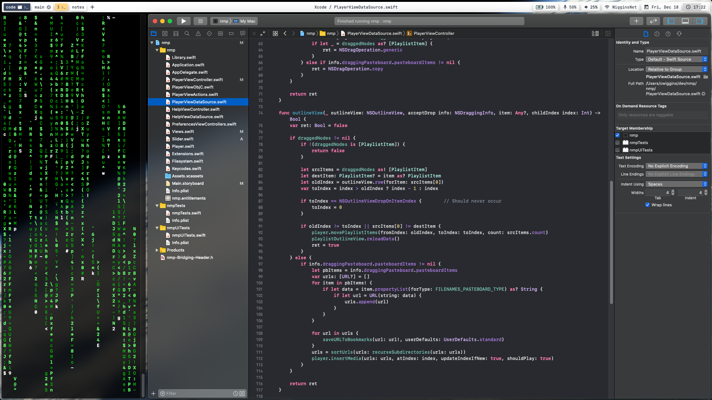

### macos-dotfiles
Configuration for macOS Catalina 10.15.7

## Features
- [Yabai tiling/stacking window manager](https://github.com/koekeishiya/yabai)
- [Ubersicht](http://tracesof.net/uebersicht/) bar: [simple-bar](https://www.simple-bar.com/)
- [powerlevel10k](https://github.com/romkatv/powerlevel10k) + zsh config
- macOS Terminal and [iTerm2](https://iterm2.com)
- [Homebrew package manager](https://brew.sh)
- [nmp music player [in development]](https://github.com/wiggocd/nmp)
- Configuration for editors: [micro](https://github.com/zyedidia/micro)
- Shell scripts

## Other Programs
- [Dozer fork for default status bar](https://github.com/wiggocd/Dozer)
- [Rectangle for window organisation](https://rectangleapp.com) (see readme over there to configure gap sizes)
- [neovim](https://neovim.io)
- [Hyper - Terminal](https://hyper.is)
- [Visual Studio Code](https://code.visualstudio.com)
- [Xcode](https://developer.apple.com/xcode/)

# Usage
- Install the programs which you require
- Go to the link to simple-bar to install the bar
- Run `./install.sh`. This will overwrite your current terminal configuration and some other configuration files
- Run `p10k configure` to setup powerlevel10k
- Start Ubersicht, click the bar and configure the bar to your needs with Command+, - the settings which I use include the light theme, floating bar and no colors for the data panel
- To get the micro text editor theme, open up micro, open the command runner with Ctrl+e and run `set colorscheme one-dark`

- Switch to dark mode and run `customdarkmode` with `restartfinder` to enable light theme for applications whilst retaining dark UI elements

Enjoy!

## Screenshots

